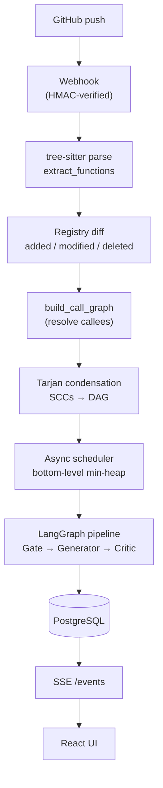
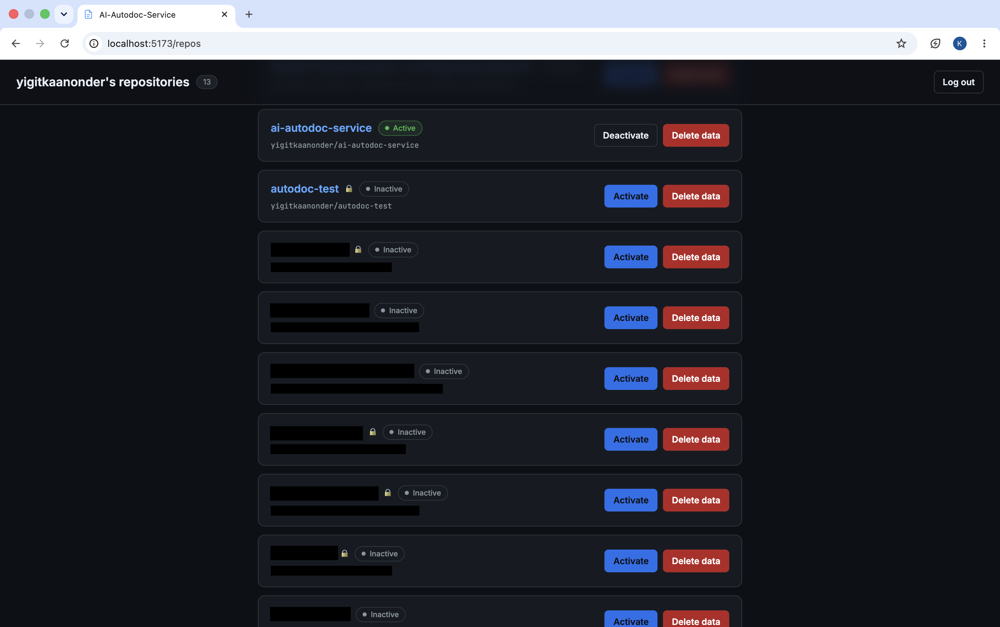
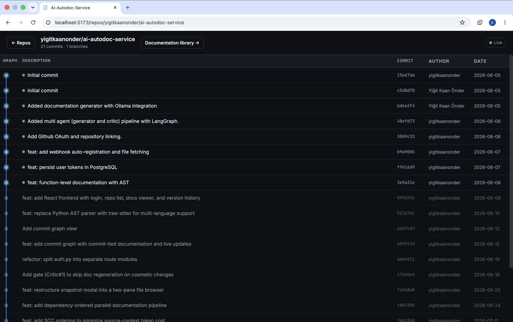
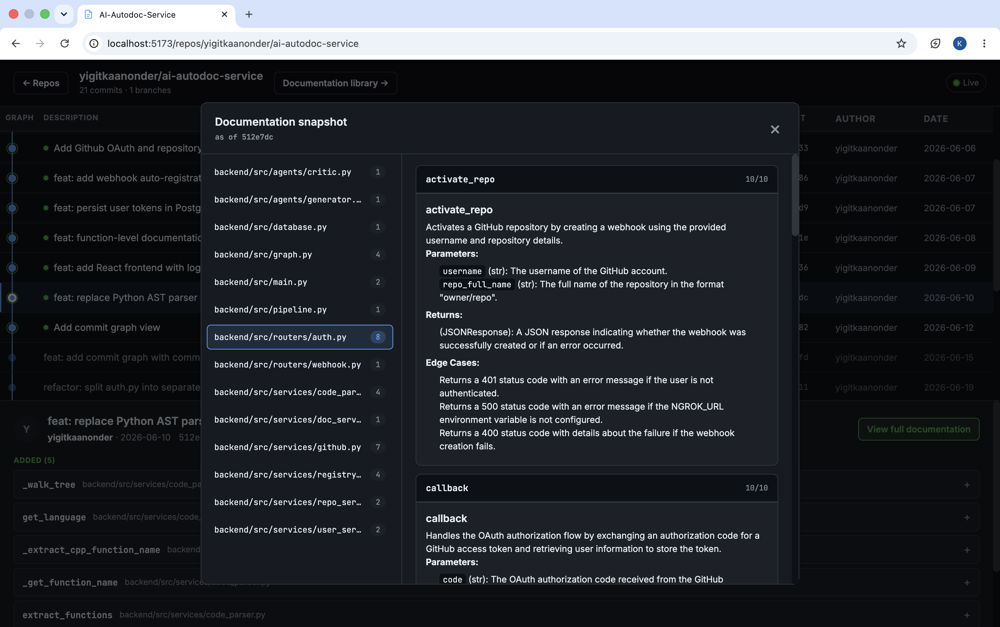
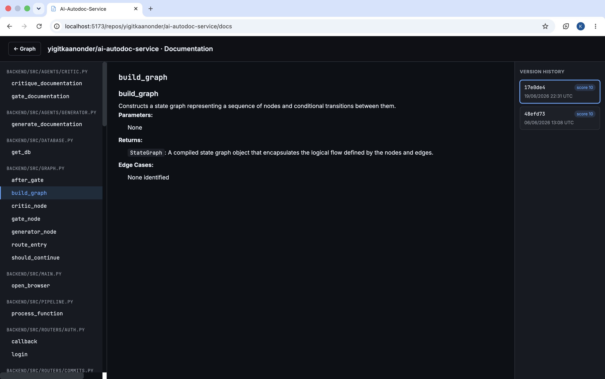

# ai-autodoc-service

Function-level docs generated automatically on every GitHub push by a local multi-agent LLM pipeline.


## Project Description

Hand-written documentation drifts out of date the moment code changes. This
service keeps function-level docs in sync automatically: it watches your GitHub
repositories and regenerates documentation only for the functions that actually
changed, using a local LLM.

End to end, a push triggers an HMAC-verified GitHub webhook. The service fetches
the changed files, parses them with tree-sitter, and diffs each file against a
per-function registry to find added, modified, and deleted functions. The
changed functions are documented by a multi-agent LangGraph pipeline running on
a local Ollama model, then stored and served through a React web UI that
receives live updates over Server-Sent Events as generation progresses.

### Key Features

- **Multi-agent LangGraph pipeline** — a Gate → Generator → Critic graph with iterative refinement, a deterministic format check, and a 0–10 critic score.
- **Call-graph-driven ordering** — Tarjan SCC condensation with topological scheduling, and bitmask DP (greedy fallback) for the optimal order inside a cycle.
- **Change-aware updates** — a function registry diffs each file so only new or modified functions are (re)documented; the Gate can keep still-valid docs.
- **Local LLM via Ollama** — generation runs against a self-hosted model, so there is no API cost and source code never leaves the machine.
- **Multi-language parsing** — tree-sitter extraction for Python, JavaScript, TypeScript, Go, Java, and C/C++.
- **Live updates** — the frontend streams progress over Server-Sent Events.
- **Security hardening** — HMAC-verified webhooks, HttpOnly session-cookie auth, Fernet at-rest token encryption, repo ownership checks, and OAuth state/CSRF protection.

**Tech stack:** Python · FastAPI · LangGraph · Celery · tree-sitter · Ollama · PostgreSQL · Redis · React · Vite, orchestrated with Docker Compose.

## Architecture

### System overview

A push to an activated repository hits the GitHub webhook, whose raw body is
verified against `X-Hub-Signature-256` (constant-time HMAC-SHA256; a missing
secret or bad signature is rejected before any parsing). The service pulls each
changed file's content, extracts its functions with tree-sitter, and diffs them
against a per-function registry to find what actually changed. The changed
functions become a *changeset*: a call graph is built over them, strongly
connected components are condensed into a DAG, and a scheduler walks that DAG,
running the LangGraph documentation pipeline on up to N functions in parallel.
Results are written to PostgreSQL, and the frontend — subscribed per repository
over Server-Sent Events — is notified to refetch.



### Change detection

Each documented function has a row in `function_registry` holding a
`content_hash` — the SHA-256 of the function's exact source slice, computed at
extraction time in `extract_functions`. On a modified file, `diff_functions`
re-extracts the current functions and compares them to the non-deleted registry
rows for that file by name:

- **new** — a current function whose name is not in the registry;
- **changed** — a name present in both, but whose `content_hash` differs;
- **deleted** — a registry name no longer present in the file.

Only new and changed functions enter the changeset; unchanged functions (same
hash) are skipped, so a push re-documents just what moved. Deletions are
soft-deletes: the registry row is flagged `is_deleted` and a tombstone
`Documentation` row (`content=NULL`, `is_deleted=True`) is appended so history is
preserved. The registry is updated *after* documentation succeeds, so a failed
or cancelled run does not advance the baseline.

### Multi-agent pipeline (LangGraph)

Each function is documented by a compiled `StateGraph` (`graph.py`) whose shared
state carries the code, mode, existing docs, dependency context, the current
draft, iteration count, and score. The entry point branches on **mode**:

- **`added`** functions go straight to the **Generator** — there is nothing to
  preserve.
- **`modified`** functions with existing documentation first hit the **Gate**
  (`gate_documentation`), a drift detector that compares the existing doc's
  claims against the new code and returns `keep` or `regenerate`. On `keep` the
  graph short-circuits to `END` with the old doc and the pipeline writes **no new
  row**; on `regenerate` it falls through to the Generator.

The **Generator** (`generate_documentation`) prompts the local Ollama model to
produce a fixed Markdown layout (`## <name>`, then `**Parameters:**`,
`**Returns:**`, `**Edge Cases:**`), prefilling `## ` and inlining dependency
context under a character budget. Its output first passes a **deterministic
format check** (`validate_format`) — no LLM call — which rejects preambles, code
blocks, or missing required sections and, on failure, loops straight back to the
Generator with the issues as feedback.

Once the format is clean, the **Critic** (`critique_documentation`) scores five
criteria — purpose, parameters, returns, edge cases, clarity — each `0–2` via a
constrained JSON schema, summed and clamped to a `0–10` score. It **approves at
`score >= 8`** (`APPROVAL_THRESHOLD`). If rejected, its per-criterion issues feed
the next Generator iteration. The loop is capped at **`MAX_ITERATIONS = 3`**;
when the cap is reached the current draft is persisted anyway with its score,
rather than dropped.

### Documentation ordering (the core algorithm)

The heart of the system is deciding *what order* to document functions in, so
that whenever a function is written its callees are already documented and can be
supplied as cheap context instead of raw source.

**1. Extraction and callee resolution.** For each function, `_collect_callees`
walks its syntax subtree and records the *simple* name of every call, but stops
at nested function-definition boundaries — a call inside a nested `def`/arrow/
method is attributed to that inner function (extracted as its own unit), not the
enclosing one (lambdas are not boundaries, so calls in an inline lambda count for
the enclosing function). `build_call_graph` then resolves each callee name to a
target: a **unique same-file match wins first**, then a **unique repo-wide
match**; anything ambiguous or unknown is recorded as *unresolved* (treated as a
library/builtin, not a dependency). **Self-recursion is not counted** as a
dependency. Targets inside the changeset become scheduling edges; targets that
exist elsewhere in the repo become *external deps* whose docs are fetched from
the DB as context.

**2. Condensation.** Mutual or circular recursion means the "callee first" order
is impossible, so `_tarjan_scc` finds strongly connected components and
`condense` collapses each into a super-node. The result is a DAG of components
(deterministic: successors sorted, components sorted, ordered by earliest
member), which `topological_order` linearizes with Kahn's algorithm.

**3. Scheduling by bottom-level.** `bottom_levels` assigns each component its
critical-path length to the deepest dependent (`blevel = 1 + max(blevel of
dependents)`). The scheduler dispatches from a min-heap keyed on `(-blevel,
comp_id)`, so the **most-depended-on functions are documented first** and their
generated docs are ready as context by the time dependents run; `comp_id` breaks
ties for fully deterministic dispatch. A component whose worker fails still
**unblocks its dependents** (they proceed without its doc as context), so a bad
function never deadlocks the run.

**4. Ordering inside a cycle.** Within an SCC there is no valid callee-first
order, so some dependency must be satisfied with the cycle-mate's raw *source*
instead of its (not-yet-generated) doc. `resolve_scc_order` minimizes the cost of
that: for an ordering, every intra-SCC dependency `f → g` where `g` is placed
**after** `f` charges `loc[g]` (g's line count), because f must inline g's full
source rather than its cheaper docs. A **bitmask DP** (`_scc_order_dp`,
`O(2ⁿ·n²)`) finds the exact minimum-cost order for components up to
**`SCC_DP_LIMIT = 20`** members; above that, `_scc_order_greedy` repeatedly picks
the function adding the least not-yet-placed dependency cost. Both are
deterministic (sorted tie-breaks).


### Concurrency model

The same "respect the dependencies, do independent work in parallel" problem is
solved at two different granularities:

- **Across changesets (process level).** A Celery app (`celery_app.py`) backed by
  Redis defines one task per push (`document_push`), each representing a whole
  changeset as a single queued unit. `worker_prefetch_multiplier=1` means a worker
  reserves only one task at a time (no greedy prefetch), `task_acks_late=True`
  re-queues a task if the worker dies mid-run, and a 6-hour `visibility_timeout`
  bounds redelivery. docker-compose runs the worker at `--concurrency=2`, so up to
  two changesets are documented in parallel across the pool; ordering within a
  single changeset is still fully enforced by the function-level scheduler below.
  Backfill is not queued this way: both the activate endpoint (`routers/repos.py`)
  and the manual backfill endpoint (`routers/events.py`) call `backfill_repository`
  directly, inline in the API request, so it runs inside the API process rather
  than on the Celery worker and is not part of the worker's concurrency pool. 
- **Within a changeset (function level).** `run_scheduler` (`scheduler.py`) is an
  async min-heap scheduler that keeps up to **`concurrency=4`** (the default)
  component workers in flight at once, filling free slots with the
  highest-priority ready components while honoring the DAG's topological order.
  Each worker runs the blocking LangGraph pipeline via `asyncio.to_thread` with
  its own short-lived DB session, and failed components retry with exponential
  backoff (`max_retries=2`) before unblocking their dependents.

Same abstract scheduling problem at two granularities — a small pool of whole
changesets in flight at the process level, and independent functions parallelized
within each changeset in dependency order.

### Backfill

When a repository is activated (or re-activated after a gap),
`backfill_repository` replays the default branch's commit history
**oldest-to-newest**. For each commit it fetches the changed files, runs the same
extract → diff → changeset → document flow as a live push, rebuilding the
registry commit-by-commit so `diff_functions` always sees the exact prior state.
After each commit is documented it advances a high-water mark,
`repository.documented_head_sha` (`models.py`). On first activation that field is
empty and the walk starts from the root commit; on re-activation the walk resumes
at the commit **after** the stored SHA, filling only the gap — and because the
mark advances per commit, an interrupted or crashed backfill resumes from where
it left off rather than restarting.

## Screenshots



*Your GitHub repositories, each with an Active/Inactive status badge and Activate / Deactivate / Delete-data actions.*




*The commit graph for a repository: documented commits (up to the documented head) are highlighted, undocumented ones dimmed, with a live/reconnecting indicator driven by SSE.*




*The full documentation snapshot at a selected commit — files on the left, each function's rendered Markdown docs and 0–10 score on the right.*




*The documentation library: functions grouped by file in the sidebar, the selected function's rendered Markdown in the center, and its per-commit version history (score / deleted) on the right.*


## Installation

Run the whole stack (API, worker, PostgreSQL, Redis) with Docker Compose; run
the frontend with Vite in dev mode. The database schema is created automatically
on startup, so there is no manual migration step.

### 1. Prerequisites

- **Docker** and **Docker Compose** — run the backend, worker, database, and Redis.
- **Ollama**, running locally with the model pulled (see step 5) — the pipeline calls it for generation.
- **Node.js** (with npm) — run the frontend dev server.
- A **GitHub OAuth App** — for login and repository access (step 4).
- **ngrok** (or an equivalent HTTP tunnel) — expose the local API so GitHub can deliver webhooks.

### 2. Clone

```bash
git clone <your-fork-or-repo-url> ai-autodoc-service
cd ai-autodoc-service
```

### 3. Environment configuration

Copy the sample env file and fill it in:

```bash
cp .env.example .env
```

Required variables (all live in `.env.example`):

**GitHub OAuth**
- `GITHUB_CLIENT_ID` — from your GitHub OAuth App (step 4).
- `GITHUB_CLIENT_SECRET` — from the same OAuth App.
- `GITHUB_WEBHOOK_SECRET` — shared secret GitHub signs webhook payloads with; the API verifies it via HMAC. Generate one:
  ```bash
  openssl rand -hex 32
  ```

**Security**
- `TOKEN_ENCRYPTION_KEY` — Fernet key used to encrypt stored GitHub tokens at rest. Generate one:
  ```bash
  python -c "from cryptography.fernet import Fernet; print(Fernet.generate_key().decode())"
  ```
- `COOKIE_SECURE` — `false` for local HTTP; set `true` behind HTTPS.

**Database**
- `DB_USER`, `DB_PASS`, `DB_NAME` — Postgres credentials/name; Compose uses them to initialize the database.
- `DATABASE_URL` — connection string. Under Compose this is overridden for the containers to point at the `db` service, so it only needs a value if you run the backend outside Docker.
- `REDIS_URL` — Redis connection string. Under Compose this is overridden for the containers to point at the `redis` service, so it only needs a value if you run the backend or worker outside Docker.

**Ollama**
- `OLLAMA_BASE_URL` — defaults to `http://localhost:11434`; under Compose the containers override this to `http://host.docker.internal:11434` to reach Ollama on the host.
- `OLLAMA_MODEL` — `qwen2.5-coder:7b`.

**URLs**
- `FRONTEND_URL` — `http://localhost:5173` (where the OAuth callback redirects after login).
- `NGROK_URL` — your public tunnel URL (step 6); used to register the GitHub webhook.

### 4. GitHub OAuth App setup

Create an OAuth App at **GitHub → Settings → Developer settings → OAuth Apps → New OAuth App**. Set the **Authorization callback URL** to the local frontend, which proxies `/api` to the backend:

```
http://localhost:5173/api/auth/callback
```

This is a localhost URL, distinct from the ngrok webhook URL. Copy the generated **Client ID** and **Client Secret** into `GITHUB_CLIENT_ID` / `GITHUB_CLIENT_SECRET`.

### 5. Pull the Ollama model

A local model is required — the pipeline calls Ollama for every generation and
review step. With Ollama running, pull the configured model:

```bash
ollama pull qwen2.5-coder:7b
```

To use a different model, pull it and set `OLLAMA_MODEL` in `.env` accordingly.

### 6. Start the tunnel

Expose the API port so GitHub can reach the webhook endpoint:

```bash
ngrok http 8000
```

Put the public URL ngrok prints into `NGROK_URL` in `.env`. On activation the app registers the webhook at `<NGROK_URL>/webhook/github`. This public URL is separate from the localhost OAuth callback, and it must be updated in `.env` whenever ngrok restarts (the URL changes).

### 7. Start the stack

```bash
docker compose up --build
```

This starts:

| Service    | URL / port                                   |
| ---------- | -------------------------------------------- |
| API        | `http://localhost:8000`                      |
| PostgreSQL | `localhost:5433` (container port `5432`)     |
| Redis      | `localhost:6379`                             |

The `api` service creates the database schema on startup, including after a `docker compose down -v` (which wipes the data volume) — no manual step needed.

### 8. Frontend (dev mode)

In a separate terminal:

```bash
cd frontend
npm install
npm run dev
```

The dev server runs at `http://localhost:5173` and proxies `/api` requests to the API at `http://localhost:8000`.

#### How React reaches the API

The frontend never calls the backend directly — every request in `frontend/src`
is a relative `/api/...` path. The connection is made by the Vite dev-server
proxy in `frontend/vite.config.js`, which forwards those requests to the API and
strips the prefix on the way through:

```js
server: {
  proxy: {
    '/api': {
      target: 'http://localhost:8000',
      rewrite: (path) => path.replace(/^\/api/, ''),
    },
  },
}
```

So a browser call to `/api/repos/{owner}/{name}/docs` arrives at the API as
`GET /repos/{owner}/{name}/docs`. Three things follow from this:

- **Everything is same-origin, so the session cookie works with no CORS setup.**
  The browser only ever talks to `localhost:5173`, so the HttpOnly `session`
  cookie is attached automatically. The API registers **no CORS middleware** —
  pointing React straight at `http://localhost:8000` would be blocked by the
  browser, so the proxy is required, not a convenience.
- **The live-update stream uses the same path.** `RepoDetailPage` opens an
  `EventSource` on `/api/repos/{owner}/{name}/events`, a long-lived
  `text/event-stream` that travels through the same proxy entry; the API sends
  `Cache-Control: no-cache` and `X-Accel-Buffering: no` so intermediaries don't
  buffer it. No extra configuration is needed for SSE.
- **Two ports, two places to change.** If the API is not on `8000`, edit
  `target` in `vite.config.js`. If the frontend is not on `5173`, update
  `FRONTEND_URL` in `.env` **and** the OAuth callback URL on GitHub (step 4) to
  match — otherwise login redirects to the wrong origin and the session cookie
  is set on a host the app never visits.

This proxy exists only in dev mode. A production build (`npm run build`) emits
static files with the same relative `/api` paths, so whatever serves them —
nginx, a CDN, or the API itself — has to route `/api` to the backend the same
way.

## Usage

Once the stack is running, this is what a first run looks like from the browser.

### 1. Log in

Open the frontend at `http://localhost:5173`. The login screen has a single
**Continue with GitHub** button, which starts the GitHub OAuth flow. Signing in
grants the app access to your GitHub repositories; on success you land on your
repository list at `/repos`. An existing session skips the login screen and goes
straight there.

### 2. Activate a repository

The repository list shows every repo your account can access, each with an
**Active / Inactive** badge and **Activate**, **Deactivate**, and **Delete data**
actions. Click **Activate** on an inactive repo. Activation does two things:

- registers a `push` webhook on that repository on GitHub (pointing at
  `<NGROK_URL>/webhook/github`), and
- backfills the existing history — it walks the default branch from the first
  commit to HEAD and documents each commit's added/changed functions in order.

The backfill runs synchronously as part of activation, and every function is
documented by the local model, so the **Activate** action stays pending for the
whole run. On a large repository the first backfill can take a long time.
Because coverage advances commit-by-commit, an interrupted activation resumes
from where it stopped the next time the repo is activated rather than starting
over.

### 3. Watch it work

Click a repository's name to open its page at `/repos/<owner>/<name>`. This is
the commit graph: commits that have been documented (up to the documented head)
are highlighted, and undocumented ones are dimmed. A **Live / Reconnecting**
indicator in the header reflects the Server-Sent Events connection, and briefly
flashes **Updated** whenever a new push is documented — the graph refreshes
without a manual reload.

Selecting a commit opens a panel listing that commit's documentation changes,
grouped into **Added**, **Changed**, and **Deleted**; each entry expands to its
rendered Markdown. For a documented commit, **View full documentation** opens the
**Documentation snapshot** modal — the complete state as of that commit, with
files on the left and each function's rendered docs and `N/10` score on the
right.

### 4. Push a commit

From here on it is automatic. Push to the activated repository as usual. GitHub
delivers the push to the webhook, and only the functions that were actually
added or changed in that push are (re)documented — unchanged functions are
skipped. No button to press: the repository page updates live over SSE as the
new docs land.

### 5. Browse the documentation

From a repository page, **Documentation library →** opens
`/repos/<owner>/<name>/docs`. Functions are grouped by file in the sidebar;
selecting one renders its current documentation as Markdown in the center and its
per-commit **Version history** on the right — each version tagged with its commit
SHA and either a `score N` badge or a `deleted` badge. Selecting an older version
shows the documentation as it stood at that commit. **← Graph** returns to the
commit graph.

### 6. Deactivate or delete data

The two actions on the repository list do different things:

- **Deactivate** removes the webhook from GitHub and marks the repo inactive, but
  **keeps** all generated documentation. Pushes are no longer documented; the
  existing docs remain browsable. Re-activating later fills only the gap of
  commits pushed while it was inactive. Deactivating also stops an in-progress
  backfill: the walk re-reads the repository before each commit and exits once it
  is inactive, keeping the commits documented up to that point.
- **Delete data** permanently wipes the stored documentation and the function
  registry for the repo and resets its documented-head marker. It does **not**
  remove the webhook or deactivate the repo.

Both actions ask for confirmation first.

### Notes

- **Cancelled commits leave nothing half-documented.** If a changeset is
  cancelled mid-commit, the partial documentation already written for that commit
  is deleted, so no half-documented commit is left behind.
- **Delete data does not stop documentation.** Because it leaves the repo active
  and the webhook in place, the next push will start documenting again from an
  empty baseline. To actually stop processing a repository, use **Deactivate**.
- **Re-activating after a database reset is safe.** Webhook creation is
  idempotent: if a hook with the same target URL already exists on GitHub (for
  example after wiping the database with `docker compose down -v`, which loses the
  stored `webhook_id`), activation reuses that hook instead of failing with
  GitHub's "Hook already exists" error.
- **A changed ngrok URL leaves a stale hook.** The reuse match is by exact webhook
  URL. If `NGROK_URL` changed since a repo was last activated, activation
  registers a new hook and the old one — pointing at the dead tunnel — is left
  behind on GitHub, since the app can only delete hooks whose id it still has
  stored. Remove obsolete hooks from the repository's webhook settings on GitHub
  if they accumulate.

## Contributing

This is a small solo project. Issues and pull requests are welcome.

**Reporting bugs / requesting features.** Open a GitHub issue. For a bug, include
what you did, what you expected, and what actually happened, plus the relevant
logs from the `api` or `worker` container (`docker compose logs api` /
`docker compose logs worker`).

**Pull requests.** Fork the repo, branch off `main`, commit your change, and open
a PR against `main`. Keep each PR focused on one thing.

**Local development.** See the [Installation](#installation) section above for
getting the full stack running.

**Conventions.**

- Commit messages follow [Conventional Commits](https://www.conventionalcommits.org)
  — `feat:`, `fix:`, `refactor:`, with an optional scope like `refactor(security):`.
- Code and comments are written in English.
- The frontend has an ESLint config (`frontend/eslint.config.js`); run
  `npm run lint` in `frontend/` before opening a PR that touches it. There is no
  automated CI, so check your changes locally.

**Testing a change.** There is no automated test suite, so verify end to end
against the real flow: run the stack, point it at a small scratch GitHub
repository, and activate it. Then push commits that add, modify, and delete
functions, and confirm on the repository page and documentation library that the
docs update as expected.

## License

Released under the MIT License. See [LICENSE](LICENSE) for the full text.

Copyright (c) 2026 Yiğit Kaan Önder
